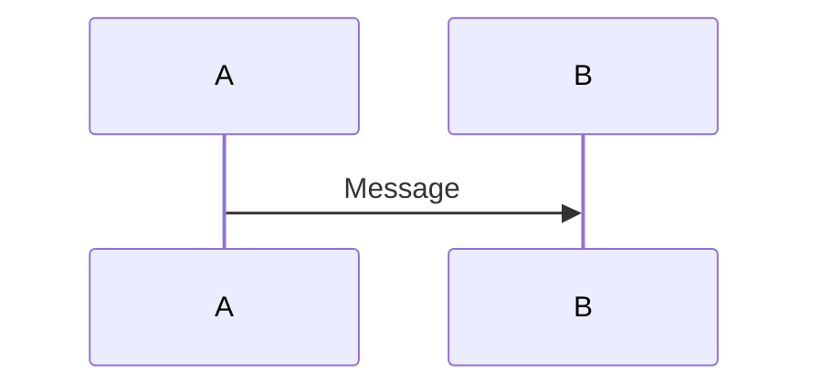
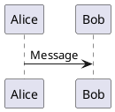

# Slidev

## Overview

Slidev is a Vue-based presentation framework for developers. Write slides in Markdown with live code highlighting, animations, Vue components, and themes. Powered by Vite + Vue + UnoCSS.

## Key Patterns

### Slide Structure
```markdown
---
theme: seriph
title: My Presentation
---

# Slide 1 Title

Content here

---

# Slide 2

- Bullet points
- More content

<!-- This is a presenter note -->
```

### Frontmatter Configuration

**Headmatter (first slide - global config):**
```yaml
---
theme: default              # Theme ID or package name
title: Presentation Title   # Auto-detected from first h1 if not set
author: Your Name          # For PDF export
aspectRatio: 16/9          # Canvas aspect ratio
canvasWidth: 980           # Canvas width in px
lineNumbers: false         # Show code line numbers
monaco: true              # Enable Monaco editor
colorSchema: auto          # auto | light | dark
---
```

**Per-slide frontmatter:**
```yaml
---
layout: center            # Override layout
clicks: 10               # Custom click count for animations
transition: slide-left   # Slide transition
hideInToc: true          # Hide from table of contents
routeAlias: intro        # Custom route alias
class: text-white        # Custom CSS class
background: /image.png   # Background image
---
```

### Layouts

Available layouts:
- `default` - Basic content layout
- `center` - Centered content
- `cover` - Title/cover slide
- `end` - Final slide
- `intro` - Introduction slide
- `section` - Section divider
- `fact` - Prominent data display
- `quote` - Quotation
- `statement` - Affirmation
- `two-cols` - Two columns (`::left::` / `::right::`)
- `two-cols-header` - Header + two columns
- `image` - Full image background
- `image-left` / `image-right` - Image + content
- `iframe` / `iframe-left` / `iframe-right` - Embed web pages
- `full` - Use full screen
- `none` - No styling

### Click Animations

Use `v-click` directive or component:
```markdown
<v-click>
  This appears after first click
</v-click>

<div v-click>
  This also appears after first click
</div>

<div v-after>
  This appears with previous click
</div>

<div v-click.hide>
  This hides after click
</div>
```

**Click positioning:**
```markdown
<div v-click>Click 1</div>
<div v-click="3">Click 3</div>
<div v-click="'+2'">Click 5 (relative +2)</div>
<div v-click="[2, 4]">Visible at clicks 2-3</div>
```

**List animations with v-clicks:**
```markdown
<v-clicks>
- Item 1
- Item 2
- Item 3
</v-clicks>

<v-clicks depth="2">
- Parent
  - Child 1
  - Child 2
</v-clicks>
```

### Code Blocks

```markdown
```ts
console.log('Hello')
```

```ts {2,4-6}   // Highlight lines 2 and 4-6
```ts {none|1|2-3}  // Line-by-line animation
```ts {at:5}  // Start at click 5
```

With Monaco editor:
```ts {monaco}
// Interactive code editor
```

Runnable code:
```ts {monaco-run}
console.log('Runs in browser!')
```
```

### Vue Components

Built-in components available directly:
```markdown
<Toc />                              # Table of contents
<Link to="5">Go to slide 5</Link>   # Navigation link
<Tweet id="20" />                    # Embedded tweet
<Youtube id="videoId" />              # YouTube embed
<VClick>Content</VClick>            # Click animation wrapper
<VAfter>Content</VAfter>             # Appear with previous
<VSwitch>                            # Multi-step switch
  <template #1>First</template>
  <template #2>Second</template>
</VSwitch>
<Arrow x1="0" y1="0" x2="100" y2="100" />  # SVG arrow
<Transform :scale="0.5">             # Scale wrapper
  Content
</Transform>
<SlideCurrentNo /> / <SlidesTotal />   # Page numbers
<LightOrDark>                         # Theme-dependent content
  <template #dark>Dark</template>
  <template #light>Light</template>
</LightOrDark>
```

### Motion Animations

Using @vueuse/motion:
```html
<div
  v-motion
  :initial="{ x: -80, opacity: 0 }"
  :enter="{ x: 0, opacity: 1 }"
  :leave="{ x: 80, opacity: 0 }"
  :click-1="{ y: 30 }"
  :click-2="{ y: 60 }"
>
  Animated content
</div>
```

### Slide Transitions

```yaml
---
transition: slide-left    # fade | fade-out | slide-* | view-transition
---

---
transition: go-forward | go-backward  # Different for forward/back
---
```

### Custom Components

Create `./components/MyComponent.vue`:
```vue
<template>
  <div class="my-component">
    <slot />
  </div>
</template>
```

Use directly in slides:
```markdown
<MyComponent>
  Custom content
</MyComponent>
```

### Custom Layouts

Create `./layouts/custom.vue`:
```vue
<template>
  <div class="slidev-layout custom">
    <div class="my-header">
      <slot name="header" />
    </div>
    <div class="my-content">
      <slot />
    </div>
  </div>
</template>
```

Use:
```yaml
---
layout: custom
---

:::header
# My Header
:::

Content here
```

### MDC Syntax

Enable in headmatter: `mdc: true`

```markdown
# My Title {.text-3xl.text-red-500}

> Blockquote {class="important"}

::div{.grid .grid-cols-2}
Left content
::
::div{.col-span-1}
Right content
::
```

### Diagrams

**Mermaid:**
```markdown

```

**PlantUML:**
```markdown

```

### LaTeX

```markdown
$$
\sum_{i=1}^n x_i
$$

Inline: $E=mc^2$

Chem: $\ce{H2O}$
```

## Commands

```bash
# Initialize new project
npm init slidev

# Start dev server (default port 3030)
npx slidev
npx slidev --port 8080 --open
npx slidev --remote          # Enable remote control
npx slidev --remote mypass   # With password

# Build for production
npx slidev build
npx slidev build --base /slides/ --out dist

# Export to PDF/PNG/PPTX
npx slidev export
npx slidev export --format pdf --with-clicks
npx slidev export --range "1,3-5,8" --dark
npx slidev export --format png --output slides.png

# Format slides.md
npx slidev format

# Eject theme for customization
npx slidev theme eject
npx slidev theme eject --dir theme
```

## Common Tasks

### Create New Presentation

```bash
npm init slidev
# Follow prompts to create project
cd my-slides
npm run dev
```

### Add a New Slide

```markdown
---

# Previous Slide

---

# New Slide

Content here
```

### Apply Theme

```bash
npm install @slidev/theme-seriph
```

```yaml
---
theme: seriph
---
```

### Create Two-Column Layout

```markdown
---
layout: two-cols
---

# Left Column

Content on the left

::right::

# Right Column

Content on the right
```

### Add Speaker Notes

```markdown
# Slide Title

Visible content

<!-- This is a speaker note only visible in presenter view -->

<!--
Multi-line
notes here
-->
```

### Custom Styling

Create `./styles/index.css` or `./styles/index.ts`:
```css
.slidev-layout {
  --uno: px-14 py-10;
}

h1 {
  --uno: text-4xl font-bold;
}

/* Custom click animation */
.slidev-vclick-target {
  transition: all 500ms ease;
}
.slidev-vclick-hidden {
  transform: scale(0);
}
```

### Static Assets

Place in `./public/`:
```markdown
  # Resolves to ./public/my-image.png
```

## Pitfalls to Avoid

1. **Wrong CLI command**
   ```bash
   # BAD - npx slidev not supported
   npx slidev
   
   # GOOD
   npx @slidev/cli
   # or after npm install:
   slidev
   ```

2. **Relative click values need quotes**
   ```markdown
   <!-- BAD -->
   <div v-click=+2>
   
   <!-- GOOD -->
   <div v-click="'+2'">
   ```

3. **Forgetting slide separators**
   ```markdown
   # Slide 1
   
   ---  <!-- Must have blank line before and after -->
   
   # Slide 2
   ```

4. **Notes must be at end of slide**
   ```markdown
   # Title
   
   <!-- This is NOT a note (not at end) -->
   
   Content
   
   <!-- This IS a note -->
   ```

5. **Using old v4 Vue syntax**
   ```markdown
   <!-- BAD (Svelte/Vue 4) -->
   <button @click="handler">
   
   <!-- GOOD (Vue 5/Slidev) -->
   <button @click="handler">
   <!-- Vue 3 style still works -->
   ```

6. **Mixing relative and absolute paths**
   - Use `/public/file.png` for static assets in `public/`
   - Use relative paths for imported slides: `src: ./pages/other.md`

7. **Motion with v-click**
   ```markdown
   <!-- Due to Vue bug, motion must be on same element as v-click -->
   <div v-click v-motion :initial="{x:0}" :enter="{x:100}">
     Works
   </div>
   ```

## Quick Reference

### Layouts
| Layout | Use For |
|--------|---------|
| `cover` | Title/cover slide |
| `center` | Centered single content |
| `default` | General content |
| `two-cols` | Side-by-side content |
| `section` | Section dividers |
| `end` | Final "Thank You" slide |

### CLI
| Command | Purpose |
|---------|---------|
| `slidev` | Dev server (port 3030) |
| `slidev --open` | Open browser |
| `slidev --remote` | Enable remote control |
| `slidev build` | Production build |
| `slidev export` | Export to PDF/PNG/PPTX |
| `slidev format` | Format slides.md |

### Animation Directives
| Directive | Behavior |
|-----------|----------|
| `v-click` | Show on next click |
| `v-after` | Show with previous element |
| `v-click.hide` | Hide on click (not show) |
| `v-click="3"` | Show at absolute click 3 |
| `v-click="'+2'"` | Show 2 clicks after previous |
| `v-click="[2,4]"` | Show only at clicks 2-3 |
| `v-clicks` | Animate all children |

### Frontmatter Keys
```yaml
---
theme: default
title: My Slides
layout: center
clicks: 5
transition: slide-left
hideInToc: true
routeAlias: intro
class: custom-class
background: /bg.png
---
```

### Transitions
- `fade` - Crossfade
- `fade-out` - Fade out then in
- `slide-left` / `slide-right` / `slide-up` / `slide-down`
- `view-transition` - Native view transition API

### Built-in Components
- `<Toc />` - Table of contents
- `<Link to="5" />` - Navigate to slide
- `<Tweet id="..." />` - Embed tweet
- `<Youtube id="..." />` - Embed video
- `<Arrow x1 y1 x2 y2 />` - Draw arrow
- `<VClick> / <VAfter> / <VSwitch>` - Animations
- `<SlideCurrentNo /> / <SlidesTotal />` - Page numbers
- `<LightOrDark>` - Theme conditional
- `<Transform :scale="0.5">` - Scale content
